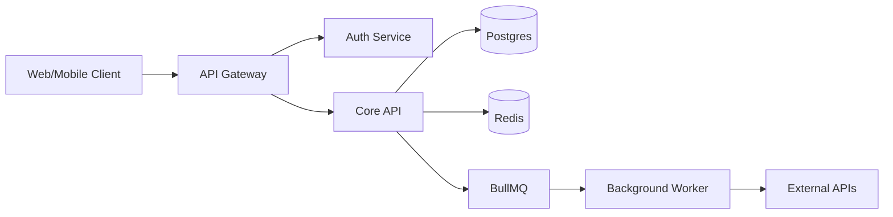
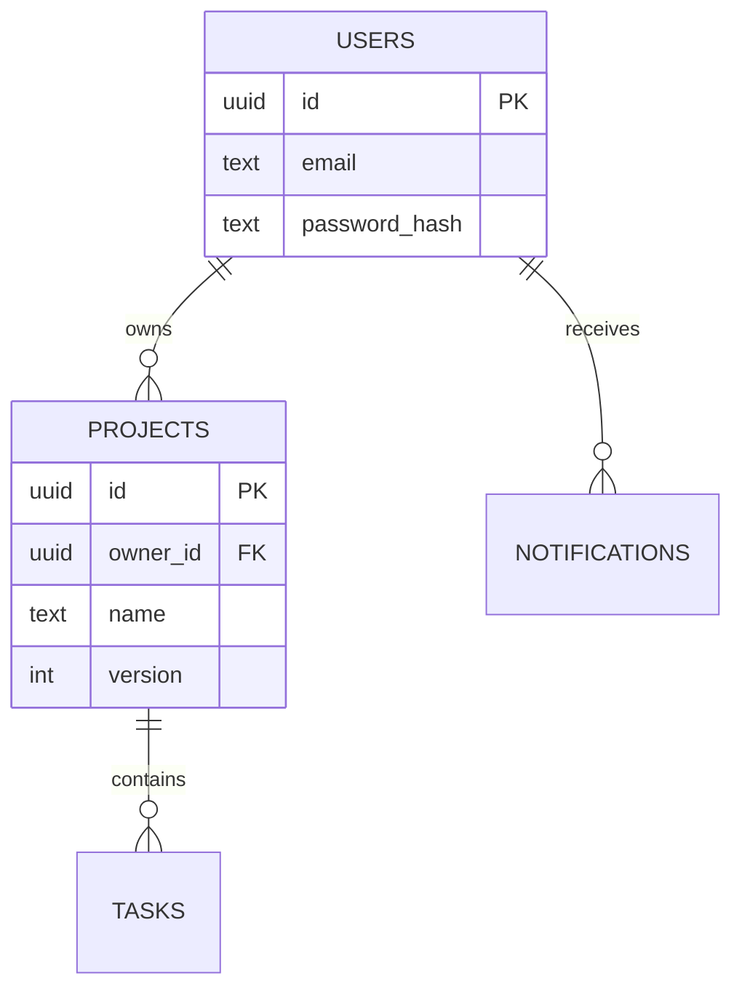

# ARCHITECTURE — 项目级系统架构（活文档）

- **维护者**：`prompts/A-architect.md`（首次 / 重构）+ `prompts/A-evolve.md`（增量同步 ADR）
- **首次创建**：<YYYY-MM-DD>
- **最近修订**：<YYYY-MM-DD>（来自 A-evolve <YYYY-MM-DD> · 详见 `.specs/evolve/<date>-EVOLVE.md`）
- **当前 ADR 编号最大值**：ADR-007

> **本文件 vs CONTEXT.md vs DESIGN.md 的边界**：
> - `CONTEXT.md`（**rules 层**）：技术栈版本、命名约定、既有抽象索引、禁动清单、code-style——AI 实施时**每个 change 都加载**，约 50-200 行
> - `ARCHITECTURE.md`（**structure 层 · 本文件**）：模块图、跨模块契约、ADR 列表、扩展点、容量边界——**仅 2-design / A-evolve 阶段加载**，约 200-600 行
> - `.specs/<change-id>/DESIGN.md`（**change 层**）：单次 change 的技术决策、本次 change 的接口契约、风险——change 归档后冻结
>
> **三层职责无重叠**：CONTEXT 回答"AI 写代码时该遵守什么"，ARCHITECTURE 回答"系统是怎么搭起来的"，DESIGN 回答"这次 change 怎么做"。

---

## 1. 系统概览

### 1.1 一句话定位

<例：一个面向中小团队的轻量项目管理 SaaS，主打离线优先 + 协作冲突自动合并。>

### 1.2 服务边界图



### 1.3 关键非功能性指标（NFR 基线）

| 维度 | 当前基线 | 来源 |
|---|---|---|
| QPS（峰值） | <例：1200> | <例：2026-Q1 压测报告> |
| P95 延迟 | <例：120ms> | <例：APM monitor> |
| 数据量 | <例：500GB / 100M rows> | <例：production snapshot> |
| 并发用户 | <例：5000> | <例：DAU peak> |
| 可用性目标 | <例：99.9%> | <例：SLA> |

> 任何会影响这些指标的 change，2-design 阶段必须显式评估。

---

## 2. 模块清单 + 边界

### 2.1 模块表

| 模块 | 路径 | 职责 | 依赖 | 暴露给谁 |
|---|---|---|---|---|
| `auth-service` | `src/services/auth/*` | 认证 / 会话 / RBAC | `db.users`, `cache.sessions` | 所有需登录的 API |
| `notification-service` | `src/services/notification/*` | 通知发送 / 模板 / 通道 | `queue.notifications`, `external.email` | API 层 / Worker |
| `project-core` | `src/features/project/*` | 项目 / 任务 / 看板 | `db.*`, `cache.*` | API gateway |
| `worker` | `worker/*` | 后台作业（导出 / 同步 / 通知）| `queue`, all services | — |

### 2.2 模块依赖规则（hard rules）

```
✅ 允许的依赖方向
- features/* → services/* → lib/* → utils/*
- worker/* → services/* → lib/*

❌ 禁止的依赖方向
- services/* → features/*（service 不能依赖业务功能）
- utils/* → lib/*（基础工具不能依赖业务库）
- 任何模块 → worker/*（worker 是消费者，不被引用）
```

如果新 change 需要破例，必须在 DESIGN § 0.5 显式声明并升级 ADR。

---

## 3. ADR 列表（Architecture Decision Records · 不可逆决策清单）

> 每条 ADR 是项目级"以后都这么干"的取舍。低成本可逆决策不进这表（留在 change 级 DESIGN）。

### ADR-001 · 数据库选型：Postgres 16

- **状态**：accepted（2026-01-15）
- **取舍**：Postgres / MySQL / CockroachDB
- **决定**：Postgres 16 via Supabase
- **理由**：JSON 字段、partial index、生态成熟；团队熟练
- **代价**：写多读少场景需要额外读副本；CockroachDB 的多区强一致放弃
- **来源 change**：(initial)
- **推翻成本**：高（数据迁移 + ORM 改造）

### ADR-002 · 缓存策略：Redis（替代原 in-memory）

- **状态**：accepted（2026-04-12）
- **取舍**：in-memory LRU / Redis / Memcached
- **决定**：Redis 7（ioredis 客户端）
- **理由**：多实例部署需要共享缓存；in-memory 在水平扩容时失效率高
- **代价**：多一个运维组件；冷启动慢
- **来源 change**：`add-cache-layer`（`.specs/archive/2026-04-12-add-cache-layer/`）
- **推翻成本**：中（应用层接口未暴露 Redis 细节）

### ADR-NNN · <标题>

- **状态**：proposed | accepted | deprecated | superseded by ADR-NNN
- **取舍**：…
- **决定**：…
- **理由**：…
- **代价**：…
- **来源 change**：<change-id 或 (initial)>
- **推翻成本**：低 / 中 / 高

> **新增 ADR 走 A-evolve**——单 change 的「DESIGN § 9.2 项目级技术决策」段经用户 review 后，由 A-evolve 转入此处。
> **改 ADR 状态走 A-architect**——deprecate / supersede 涉及全局影响，需要重新评估。

---

## 4. 跨模块契约

### 4.1 公共 HTTP API

```
/api/auth/*              ← auth-service
  POST   /login          → { token, expiresAt }
  POST   /logout         → 204
  POST   /refresh        → { token }

/api/projects/*          ← project-core
  GET    /:id            → Project
  PATCH  /:id            → Project（乐观锁 If-Match: <version>）

/api/notifications/*     ← notification-service
  POST   /send           → { messageId }（需 admin scope）

# 内部服务调用走相同路由 + service-token，不再单独定义 RPC
```

### 4.2 事件总线

```
events.user.created          → auth-service 发布 / notification 订阅
events.project.updated       → project-core 发布 / cache invalidator 订阅
events.cache.invalidated     → 任何 service 发布 / 所有节点订阅
```

### 4.3 数据库 schema（顶层关系，详细 schema 走 migrations）



### 4.4 共享配置项

| 配置 | 类型 | 默认 | 影响模块 |
|---|---|---|---|
| `CACHE_TTL` | int (sec) | 3600 | 全部 |
| `RATE_LIMIT_PER_MIN` | int | 60 | API gateway |
| `JWT_EXPIRES_IN` | duration | 24h | auth-service |

---

## 5. 扩展点（Where to plug in new things）

> 新功能加在哪：本段帮新人 / AI 在 2-design 阶段快速定位。

| 你想加 | 加在哪 | 关键 hook |
|---|---|---|
| 新 API endpoint | `src/api/<domain>/route.ts` | 注册到 `src/api/index.ts`，自动走 gateway 中间件 |
| 新背景作业 | `worker/jobs/<name>.ts` | 注册到 `worker/index.ts` job map |
| 新通知通道 | `services/notification/channels/<name>.ts` | 实现 `NotificationChannel` 接口 |
| 新缓存域 | `services/cache/namespaces/<name>.ts` | 用 `cache.namespace(name)` 包装 ioredis |
| 新认证 provider | `services/auth/providers/<name>.ts` | 实现 `AuthProvider` 接口 |

---

## 6. 容量 / 性能边界（Where things break）

> 已知的扩展上限。超过这些 → 触发 ADR 重审。

| 边界 | 当前上限 | 预警阈值 | 触发什么 |
|---|---|---|---|
| 单库连接数 | 200 | 150 | 加 PgBouncer / 拆库 |
| Redis 内存 | 8GB | 6GB | 调 maxmemory-policy / 加节点 |
| BullMQ queue depth | 100k | 60k | 加 worker / 拆队列 |
| 单 API rps | 2000 | 1500 | 限流 / 加 gateway 节点 |

---

## 7. 已知技术债 + 长期方向

> 这里记**项目级**技术债。change 级的债走 SUMMARY → LESSONS。

| 债 | 影响 | 优先级 | 触发条件（什么时候必须还）|
|---|---|---|---|
| <例：legacy `cache-old.ts` 仍被 3 个旧路由使用> | 缓存策略不一致 | 中 | 那 3 个路由下次有 change 时必须替换 |
| <例：未做读写分离> | DB 主库压力高 | 低 | QPS 持续 > 1500 触发 |

---

## 8. 修订历史

| 日期 | 修改人 | 概要 | 工作流 |
|---|---|---|---|
| <YYYY-MM-DD> | A-architect | 首次创建 | A-architect 首跑 |
| <YYYY-MM-DD> | A-evolve | ADR-002 新增（来自 add-cache-layer）| A-evolve |
| <YYYY-MM-DD> | A-architect | ADR-001 重审：保持 Postgres，否决 CockroachDB 迁移 | A-architect 重构跑 |

> 详细修订内容见 `.specs/evolve/<date>-EVOLVE.md` 或 `.specs/archive/<arch-change-id>/`。
